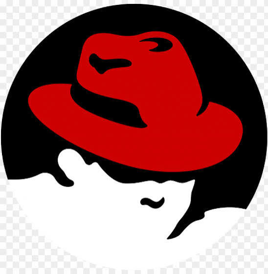
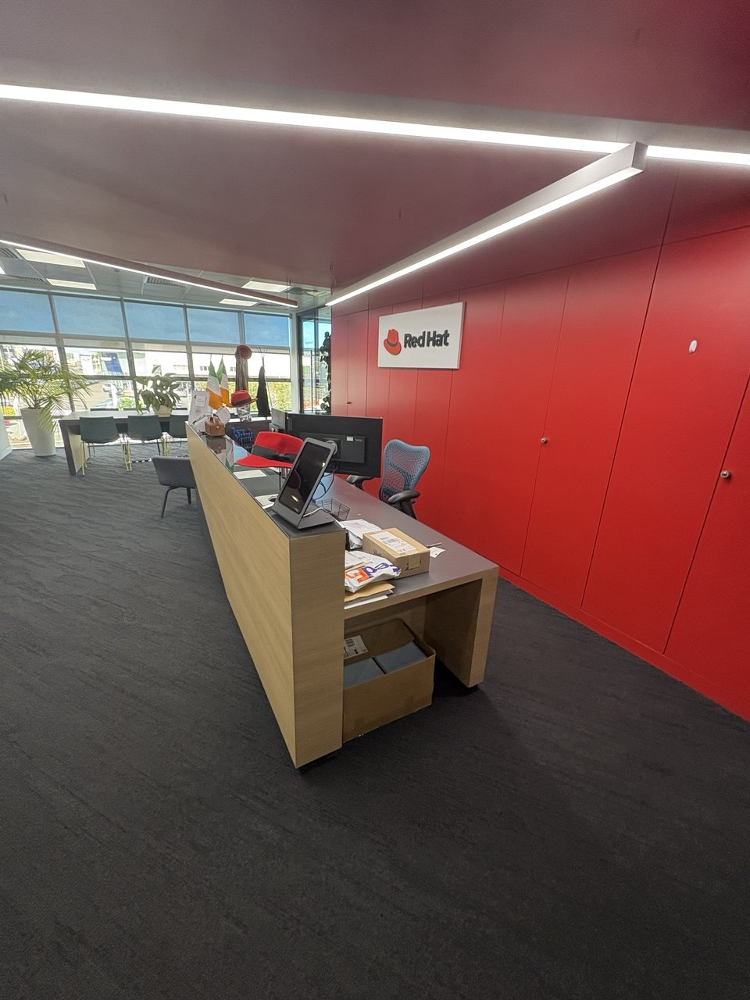
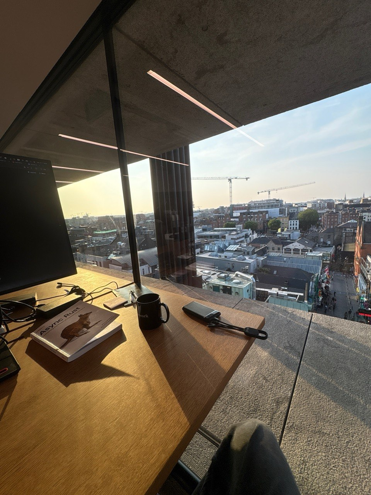
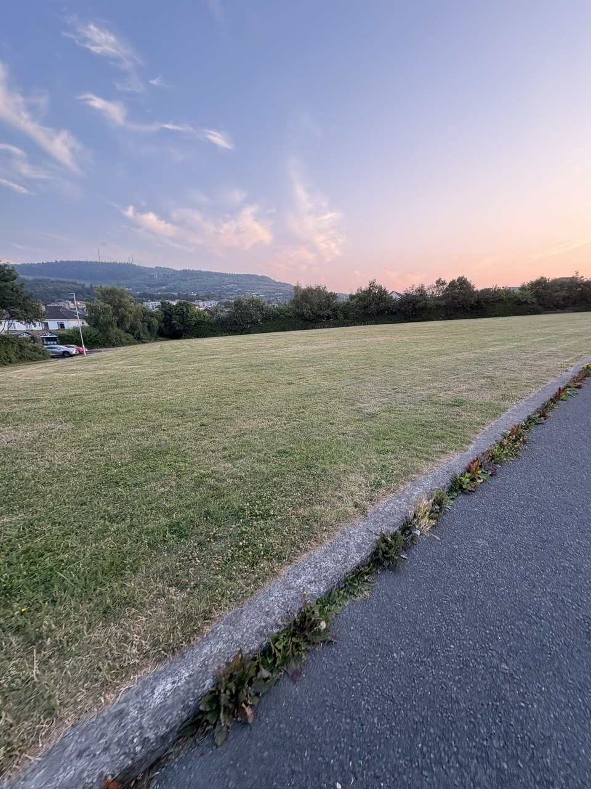

# The lore behind the internship at Red Hat

*28/09/2026 · ~4 min read*

This is my first post. It's about my 4 months at Red Hat as an AI Engineering intern. Not the LinkedIn version. The real one.

## Who I was going in

Rust. C++. Tech books. Whatever corner of CS I could get my hands on. I built agents, some libs, a ray tracer, a couple of interpreters, some games.

There was only ever one goal: understand how the thing actually works. All the way down. If you can't build or explain it, you don't understand it.

I also believed something depressing. Engineers don't get to work on what they care about. You sell your hours to someone else's roadmap and keep the interesting stuff for nights and weekends.

On paper, I was joining a RAG team. Python, Go, embeddings, vector DBs. I did not expect AI agent infra. I did not expect Rust.

I was wrong. Good.

## Red Hat 



XYZ team. AI infrastructure. When I showed up, they were building a Kubernetes operator for agent identity, [rossoctl](https://github.com/rossoctl/operator). Go, K8s, SPIFFE/SPIRE. Two weeks of reading the arch, learning the tooling, figuring out how the team moves.

Reading the arch wasn't a solo thing. It was arguing about it with a teammate. We traced the whole data pipeline, every request end to end, how K8s infra actually runs at enterprise scale, why security gets done one way and not another. I learned more in those conversations than from any doc. Best part of the first weeks.

Then my first contribution.

The normal story goes on from here. Intern ships a few more PRs to the operator, writes a nice summary, goes back to college.

That's not what happened.

A few weeks in, a teammate and I were discussing two open-source projects solving overlapping problems: [Praxis](https://github.com/praxis-proxy/praxis) and [NVIDIA OpenShell](https://github.com/NVIDIA/OpenShell). Both Rust. Not "has Rust bindings." Rust as the main language.

We drew system design diagrams for both and put them in front of our manager.

Silence.

A couple of days later, the team was moving to OpenShell. Did the diagrams matter? I don't know. It happened.

Think about it from where I was sitting. An intern. Writing his favourite lang. Contributing to an NVIDIA project. Building the runtime that AI agents live inside. A month earlier this wasn't even on the list of things I could imagine.

## Async as a workflow

A new project is three problems at once. You don't solve them in order. You poll all of them.

```rust
#[tokio::main]
async fn main() {
    let help_the_team = async {
        // Most of the team hadn't written Rust before.
        // I teamed up with the one teammate who had,
        // and we wrote an onboarding doc together.
        // I also pointed another teammate to resources
        // on the language's philosophy.
        write_onboarding_doc().await;
        pop_resources_from_head().await
    };

    let understand_the_system = async {
        // Understand the hard architecture decisions,
        // and get hands-on with the product itself.
        read_the_arch().await;
        play_with_openshell().await
    };

    let find_first_issue = async {
        // Self-explanatory.
        browse_issues("good first issue").await
    };

    let (doc, context, issue) =
        tokio::join!(help_the_team, understand_the_system, find_first_issue);

    first_contribution(doc, context, issue).await;
}
```

## What about AI?

Everyone asks this now, so here's the answer.

AI doesn't get to do the understanding. That's the one part I won't outsource. If I ship code I don't understand, I'm not an engineer. I'm a proxy for a model.

So the loop is:

1. Understand the code I'm touching. Claude helps me read it.
2. Come up with solutions myself. Then throw them at Claude and ask what I'm missing.
3. Write the code. Myself.
4. Optimize what deserves it.
5. Polish with Claude.

Claude reads with me. Claude argues with me. Claude doesn't think for me.

And it compounds. The more of OpenShell I understood, the faster my PRs got reviewed. Then I was making architecture calls, not just implementing them. [Like this one](https://github.com/NVIDIA/OpenShell/pull/3209). At some point it stopped feeling like someone else's codebase.

That's ownership. You can't prompt your way into it.

## Conclusion

I thought I was going to get a Mickey Mouse project. I got [the kind of thing Jensen Huang goes on CNBC to talk about](https://www.youtube.com/watch?v=nnwIi6547DU). And a team of people who are genuinely great, as engineers and as humans.

The network alone was worth it. I walked in knowing nobody. I walked out knowing people across the whole ladder, from other interns to principal and distinguished engineers.

I also walked out a better engineer, with a better philosophy. I used to dream about big corps. Now I think they're a bad place to start. You're one new hire in a machine of thousands, and you get the grunt work nobody else wants. Here I got a real problem, in a real open-source codebase, in my favourite language.

---

A few frames from the four months:





So much for "engineers don't get to work on what they're interested in."


